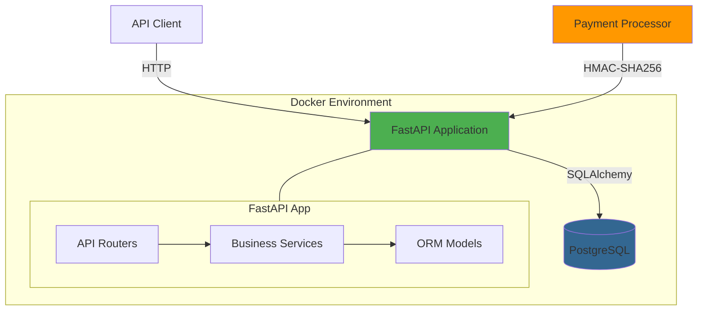

# E-commerce Platform API

A RESTful API for product management, order processing, and secure payment webhooks with HMAC-SHA256 authentication.

## Features

### Core Functionality
- **Product Management**: Full CRUD operations with inventory tracking
- **Order Management**: Multi-product orders with automatic inventory deduction
- **Payment Webhooks**: Secure webhook endpoint with HMAC-SHA256 authentication
- **State Machine**: Strict order status transitions (pending → completed/canceled)
- **Atomic Transactions**: Order creation and inventory updates are atomic
- **Comprehensive Testing**: 66 tests covering unit and integration scenarios

### API Features
- Pagination and filtering for list endpoints
- Automatic API documentation (Swagger UI / ReDoc)
- Input validation with detailed error messages
- RESTful design with appropriate HTTP status codes

---

## Architecture

### Tech Stack

| Component | Technology | Version |
|-----------|-----------|---------|
| **Language** | Python | 3.11 |
| **Framework** | FastAPI | 0.122.0 |
| **Database** | PostgreSQL | 17-alpine |
| **ORM** | SQLAlchemy | 2.0.25 |
| **Validation** | Pydantic | 2.5.3 |
| **Testing** | Pytest | 7.4.4 |
| **Containerization** | Docker + Docker Compose | - |

### System Architecture



### Project Structure

```
e-commerce-platform/
├── app/
│   ├── main.py              # FastAPI entry point
│   ├── config.py            # Configuration
│   ├── database.py          # Database connection
│   │
│   ├── models/              # SQLAlchemy ORM models
│   │   ├── product.py       # Product model
│   │   ├── order.py         # Order model + enums
│   │   └── order_item.py    # Order-Product association
│   │
│   ├── schemas/             # Pydantic validation
│   │   ├── product.py       # Product schemas
│   │   ├── order.py         # Order schemas
│   │   └── webhook.py       # Webhook schemas
│   │
│   ├── routers/             # API endpoints
│   │   ├── product_router.py
│   │   ├── order_router.py
│   │   └── webhook_router.py
│   │
│   ├── services/            # Business logic
│   │   ├── product_service.py
│   │   ├── order_service.py
│   │   └── webhook_service.py
│   │
│   └── utils/               # Utilities
│       ├── validators.py    # State machine
│       └── webhook_auth.py  # HMAC verification
│
├── tests/                   # 66 tests (32 unit + 34 integration)
│   ├── conftest.py
│   ├── unit/
│   └── integration/
│
├── alembic/                 # Database migrations
├── docker-compose.yml       # Docker orchestration
└── Makefile                 # Convenience commands
```

---

## Quick Start

### Prerequisites
- Docker and Docker Compose
- Git

### Start the Application

**Option 1: Use Pre-built Image (Recommended)**

```bash
# Clone and start with remote image
git clone <repository-url>
cd e-commerce-platform-berkeleypayment
make up-remote
```

**Option 2: Build Locally**

```bash
# Clone and build from source
git clone <repository-url>
cd e-commerce-platform-berkeleypayment
make up
```

**That's it!** The API is ready at:
- 🌐 API: http://localhost:8000
- 📚 Swagger UI: http://localhost:8000/docs

## API Endpoints

### Products

| Method | Endpoint | Description |
|--------|----------|-------------|
| POST | `/api/products` | Create product |
| GET | `/api/products` | List products (pagination & filtering) |
| GET | `/api/products/{id}` | Get product |
| PUT | `/api/products/{id}` | Update product |
| DELETE | `/api/products/{id}` | Delete product |

### Orders

| Method | Endpoint | Description |
|--------|----------|-------------|
| POST | `/api/orders` | Create order (auto deducts inventory) |
| GET | `/api/orders` | List orders (pagination & filtering) |
| GET | `/api/orders/{id}` | Get order |
| PUT | `/api/orders/{id}/status` | Update status (pending→completed/canceled) |

### Webhook

| Method | Endpoint | Description |
|--------|----------|-------------|
| POST | `/api/payment-webhook` | Payment status update (HMAC-SHA256 auth) |

## Usage Examples

### Create Product
```bash
curl -X POST http://localhost:8000/api/products \
  -H "Content-Type: application/json" \
  -d '{"name": "Laptop", "price": 999.99, "quantity": 50}'
```

### Create Order
```bash
curl -X POST http://localhost:8000/api/orders \
  -H "Content-Type: application/json" \
  -d '{
    "customer_id": 12345,
    "products": [{"product_id": "uuid-here", "quantity": 2}]
  }'
```

### Send Payment Webhook
```python
import hmac, hashlib, json

# Generate signature
payload = {"order_id": "uuid", "payment_status": "paid"}
signature = hmac.new(
    secret.encode(),
    json.dumps(payload).encode(),
    hashlib.sha256
).hexdigest()

# Send with X-Signature header
```

**Security**: Returns 401 for invalid/missing signatures.

## Design Decisions

### 1. UUID Primary Keys
- **Why**: Distributed-friendly, prevents enumeration attacks, no ID conflicts
- **Tradeoff**: Slightly larger storage vs better security

### 2. Order Items Table
- **Why**: Preserves historical prices, supports multi-product orders
- **Schema**: Stores `price_at_purchase` to maintain accounting accuracy

### 3. Inventory Management
- **Strategy**: Deduct on order creation, restore on cancellation
- **Atomicity**: Database transactions ensure consistency
- **Known limitation**: High concurrency may need pessimistic locking

### 4. State Machine
```
pending → completed  ✅
pending → canceled   ✅ (restores inventory)
completed → *        ❌ (terminal state)
canceled → *         ❌ (terminal state)
```

### 5. HMAC-SHA256 Authentication
- **Why**: Industry standard (Stripe, GitHub, PayPal)
- **Security**: Constant-time comparison, shared secret, prevents tampering
- **Alternatives considered**: API keys (less secure), IP whitelist (inflexible), mTLS (complex)

**For detailed design decisions and tradeoffs, see [`pre_readme.md`](pre_readme.md)**

## Testing

**Coverage: 66 tests (100% passing)**
- 32 unit tests (business logic)
- 34 integration tests (API workflows)

```bash
# Run all tests
make test

# Or manually
python -m pytest tests/ -v
```

**Test coverage includes:**
- State machine transitions
- HMAC signature verification
- Order/inventory management
- Complete API workflows
- Error handling

## Available Commands

```bash
# Quick Start
make up         # Start services (build locally)
make up-remote  # Start services (use pre-built image)
make down       # Stop services

# Development
make dev        # Start local development
make logs       # View logs
make restart    # Restart services

# Testing
make test       # Run all tests
make test-unit  # Run unit tests only
make test-int   # Run integration tests only

# Deployment
make pull-image # Pull pre-built image
make push       # Build & push multi-platform images

# Maintenance
make clean      # Clean everything
make help       # Show all commands
```

For local development without Docker:
```bash
docker-compose up -d postgres  # Start database only
python3 -m venv venv
source venv/bin/activate
pip install -r requirements.txt
python init_db.py
uvicorn app.main:app --reload
```

## Assumptions

The following assumptions were made to complete the assignment. These represent decisions made given ambiguous requirements and serve as discussion points.

### Business Logic
- **Customer Management**: Customers exist in an external system; we accept `customer_id` as integer without validation
- **Payment Processing**: External payment processor handles transactions; we only receive webhook notifications
- **Inventory Strategy**: Inventory deducted on order creation, restored on cancellation (not on payment failure)
- **Order Cancellation**: Only pending orders can be canceled; completed/canceled orders are terminal states
- **Price Changes**: Historical order prices preserved via `price_at_purchase` field
- **Currency**: Single currency assumed (no multi-currency support)

### Technical Decisions
- **Concurrency**: Database transactions provide atomicity; suitable for low-to-medium traffic
  - High-traffic scenarios may require optimistic/pessimistic locking
- **Data Persistence**: No session storage; stateless API design
- **Webhook Idempotency**: Safe to receive duplicate webhooks (payment status won't change if already set)
- **Database**: PostgreSQL chosen for ACID compliance and UUID support
- **Deployment**: Single-region deployment assumed

**All assumptions are documented in code and can be adjusted based on production requirements.**

## Future Improvements

Given more time, valuable enhancements:

1. **Authentication & Authorization**: JWT tokens, role-based access
2. **Performance**: Redis caching, read replicas, database optimization  
3. **Monitoring**: Prometheus metrics, structured logging, distributed tracing
4. **Features**: Product search, order tracking, email notifications
5. **Deployment**: CI/CD pipeline, Kubernetes manifests

**Project completed as Berkeley Payments take-home assignment**
